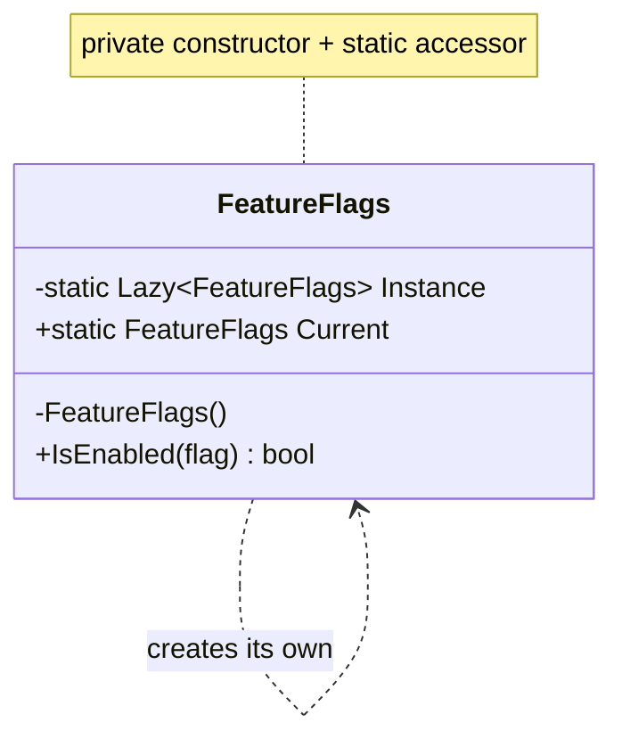

# Singleton

🌍 🇬🇧 English (this file) · 🇫🇷 [Français](Singleton-fr.md)

> Ensures a type has only one instance, and provides a global point of access to it.
>
> — Gamma, Helm, Johnson & Vlissides, *Design Patterns*, 1994

## The problem

Some things should exist once in a process. A registry of feature flags read from disk at start-up, a
connection pool, a window manager. Two of them would not be twice as good — they would disagree.

So you need two guarantees at once: **one instance exists**, and **the code that needs it can reach
it**. Nothing in the language gives you either. A `public` constructor lets anyone make a second one,
and a well-behaved single instance is no use if it is buried three constructors deep from where it is
needed.

## The solution

Take the constructor away from callers and hand out the instance yourself. The type creates its own
sole instance, keeps it in a static field, and exposes it through a static accessor. Because the
constructor is private, the guarantee is enforced by the compiler rather than asked for in a comment.

The two guarantees arrive together, and **that is the whole of the pattern — and, as we will see, its
central problem.**

## Structure



One box. Singleton is the only Gang of Four pattern with a single participant, which is why the
annotation is flat: `[Singleton]`, never `[Singleton.Singleton]`.

## The role

| Role | Annotation | Applies to | What it carries |
|---|---|---|---|
| Singleton | `[Singleton]` | class | Ensures a type has only one instance, and provides a global point of access to it. |

## The example

From [`SingletonUsage.cs`](../../../../DesignPatternCatalog.Usage/GangOfFour/SingletonUsage.cs) — a
set of feature flags, read once and asked many times.

```csharp
[Singleton]
public sealed class FeatureFlags {
```

The annotation says what the class promises. Nothing enforces it — the attribute carries no behaviour
— but a rule you write can now check the promise against the code: every class marked `[Singleton]`
has a private constructor, or the build fails. That is the whole point of annotating rather than
trusting a comment.

```csharp
    private static readonly Lazy<FeatureFlags> Instance = new(() => new FeatureFlags());

    private FeatureFlags() { }

    public static FeatureFlags Current => Instance.Value;
```

Three lines, and each does one job.

`Lazy<T>` builds the instance the first time `Current` is read, not when the type is loaded, and it is
**thread-safe by default** — several threads racing on `Current` get the same instance, and the
factory runs once. Before `Lazy<T>` existed, this is what people wrote by hand and got wrong; the
POSA2 catalogue holds a whole pattern about the ways they got it wrong, `DoubleCheckedLockingOptimization`.

`private FeatureFlags()` is the part that makes it real. Without it, `new FeatureFlags()` still
compiles everywhere and the class is a singleton by convention only.

```csharp
    public bool IsEnabled(string flag) => false;
}
```

Note what is missing: **no mutable state**. There is no `SetFlag`, no cache, no last-query field. That
is not an accident of a small sample — it is the discipline the lifetime imposes, and the next section
is about what happens when it is missing.

## When to use it

The book gives two cases:

* **there must be exactly one instance, and it must be reachable from a well-known point** — and note
  that both halves have to be true;
* **the sole instance should be extensible by subclassing**, and clients should use the extended
  instance without changing their code.

In practice, on .NET, it earns its place when all of these hold at once:

* the thing is genuinely process-wide — not per-request, not per-tenant, not per-test;
* it is **immutable after construction**, or its mutation is safe under concurrency;
* building it is expensive enough that building it twice would be felt;
* it must be reachable from somewhere a constructor parameter cannot go — a static context, a source
  generator, an analyzer, an extension method.

That last condition is the one that usually fails, and it is the one that matters.

## When not to use it

**Because "one instance" and "global access" are two different requirements, and Singleton fuses
them.** Almost always you want the first and not the second. A container gives you one instance
without a global access point: register the type once, take it as a constructor parameter, and you
have the lifetime without the reachability. That is a different pattern with a different name — the
`DependencyInjection` catalogue holds it as `SingletonLifestyle` — and it is the right default.

Concretely, do not reach for Singleton when:

* **A container is available.** `SingletonLifestyle` gives the same lifetime, and the dependency
  appears in the constructor where a reader and a test can see it.
* **Callers would reach it statically.** A class that calls `FeatureFlags.Current` inside a method has
  a dependency that its signature does not declare. Nothing can substitute it, so nothing can test the
  class in isolation. The `DependencyInjection` catalogue names this shape and files it as an
  anti-pattern: `AmbientContext` for the static access point, `ControlFreak` for the class that
  reaches out and takes what it needs.
* **It would hold mutable state.** One instance for the whole process means one instance for every
  thread in it. A field remembering the last query is a field shared by everybody who ever queries.
* **Tests need isolation.** State that survives the process survives your test suite: one test's
  mutation is the next test's starting point, and the failure appears in whichever test runs second.
* **There is only one today.** "There will only ever be one database" is a sentence that ages. Per-
  tenant, per-region and per-test multiplicities arrive later, and unwinding a static accessor from a
  hundred call sites is much harder than changing a registration.

**A note on attribution.** The book lists benefits for Singleton and no drawbacks. Everything in this
section beyond the first two bullets is the field's judgement accumulated since 1994, not Gamma,
Helm, Johnson and Vlissides'. It is included because a page that repeats only the 1994 view would send
a reader into a decision the industry has since largely reversed — but the two are not the same
authority and should not be read as one.

## What it costs

**What the book credits it with**

* controlled access to the sole instance;
* a smaller namespace than global variables;
* room to refine the operation and the representation later, by subclassing;
* the option of allowing a variable number of instances later, by changing only the accessor;
* more flexibility than static methods on a class, which cannot be overridden or swapped.

**What it charges**

* the dependency is invisible in the signatures of everything that uses it;
* substituting it — in a test, in another tenant, in a second process — means changing every call
  site, because there is no seam;
* the lifetime is the process, so every mutation is concurrent and every leak is permanent;
* state crosses test boundaries, and the resulting failures are order-dependent.

## Patterns it is confused with

| | |
|---|---|
| **`SingletonLifestyle`** (Dependency Injection) | The same lifetime, none of the global access. A container holds one instance and hands it out through constructors. **This is what most people mean when they say "singleton" today**, and the two catalogues hold both because the works disagree about them. |
| **A static class** | Also reachable from anywhere, also one of them — but it cannot implement an interface, cannot be subclassed, cannot be passed as a parameter, and cannot be swapped. Singleton keeps those doors open; a static class closes them. |
| **`AmbientContext`** (Dependency Injection) | A static access point to a dependency. The mechanism Singleton offers, considered as a way of *obtaining collaborators* — and refused on that ground by the work that names it. |
| **Monostate** | Not in this catalogue. Many instances sharing static state: the access is normal, the state is single. Inverts what Singleton does. |

`AbstractFactory`, `Builder` and `Prototype` are often *implemented* as singletons — one factory
object serves a whole application — which is a use of this pattern rather than a competitor to it.

## Where this comes from

*Design Patterns: Elements of Reusable Object-Oriented Software*, Gamma, Helm, Johnson & Vlissides,
Addison-Wesley, 1994 — the Creational patterns chapter.

* [Index entry](../../../generated/catalog-index.md#singleton-gang-of-four) — the annotation, the
  target, the links.
* [Generated attribute](../../../../DesignPatternCatalog.GangOfFour/Singleton.cs)
* [Sample](../../../../DesignPatternCatalog.Usage/GangOfFour/SingletonUsage.cs)
