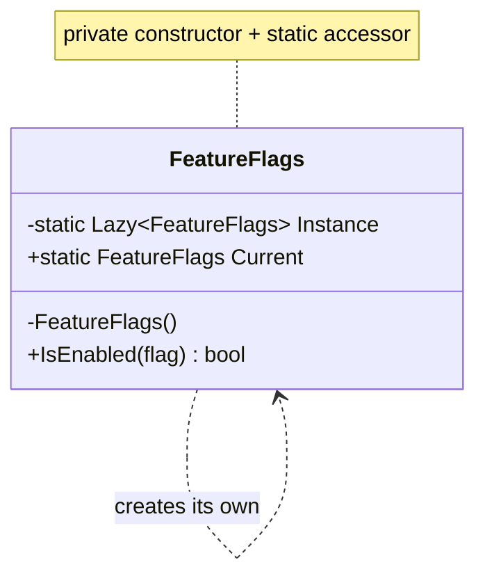

# Singleton

🌍 🇬🇧 English (this file) · 🇫🇷 [Français](Singleton-fr.md)

## Intent

Singleton is a creational pattern that ensures a type has only one instance, and provides a global
point of access to it.

## Problem

Some things should exist once in a process: a registry of feature flags read from disk at start-up, a
connection pool, a window manager. Two of them would not be twice as good — they would disagree.

Two guarantees are therefore needed at once. One instance must exist, and the code that needs it must
be able to reach it. The language offers neither: a `public` constructor lets anyone build a second
one, and a well-kept single instance is no use if it sits three constructors away from the code that
needs it.

## Solution

The pattern takes the constructor away from callers and hands out the instance itself. The type creates
its own sole instance, keeps it in a static field, and exposes it through a static accessor. Because
the constructor is private, uniqueness is enforced by the compiler rather than requested in a comment.

The two guarantees arrive together. That is the whole of the pattern, and it is also its central
problem.

## Structure



One box. Singleton is the only Gang of Four pattern with a single participant, which is why the
annotation is flat: `[Singleton]`, not `[Singleton.Singleton]`.

## The role

| Role | Annotation | Applies to | What it carries |
|---|---|---|---|
| Singleton | `[Singleton]` | class | Ensures a type has only one instance, and provides a global point of access to it. |

## The example

From [`SingletonUsage.cs`](../../../../DesignPatternCatalog.Usage/GangOfFour/SingletonUsage.cs): a set
of feature flags, read once and asked many times.

```csharp
[Singleton]
public sealed class FeatureFlags {
```

The annotation states what the class promises. It does not enforce it — the attribute carries no
behaviour — but an architecture rule can check the promise against the code: every class marked
`[Singleton]` has a private constructor, or the build fails.

```csharp
    private static readonly Lazy<FeatureFlags> Instance = new(() => new FeatureFlags());

    private FeatureFlags() { }

    public static FeatureFlags Current => Instance.Value;
```

`Lazy<T>` builds the instance the first time `Current` is read rather than when the type is loaded, and
it is thread-safe by default: several threads racing on `Current` get the same instance and the factory
runs once. Before `Lazy<T>`, this mechanism was written by hand, and the POSA2 catalogue holds a whole
pattern devoted to the ways it was got wrong: `DoubleCheckedLockingOptimization`.

The private constructor is what makes uniqueness effective. Without it, `new FeatureFlags()` compiles
everywhere and uniqueness is only a convention.

```csharp
    public bool IsEnabled(string flag) => false;
}
```

The class carries no mutable state: no `SetFlag`, no cache, no field remembering the last query. That
is not a simplification made for the sample, it is the discipline the lifetime imposes — the next
section describes what happens when it is missing.

## Applicability

**Use Singleton when there must be exactly one instance and it must be reachable from a well-known
point.** Both halves of the sentence have to be true, and it is the second that most often fails.

**Use Singleton when the sole instance should be extensible by subclassing**, with clients using the
extended instance without changing their code.

On .NET, the pattern earns its place when these conditions hold together:

* the thing is genuinely process-wide — not per-request, not per-tenant, not per-test;
* it is immutable after construction, or its mutation is safe under concurrency;
* building it costs enough that building it twice would be noticed;
* it must be reachable from somewhere a constructor parameter does not reach: a static context, a
  source generator, an analyzer, an extension method.

## When not to use it

"One instance" and "global access" are two separate requirements, and Singleton fuses them. Almost
always only the first is wanted. A dependency injection container supplies one instance without a
global access point: the type is registered once and taken as a constructor parameter. The
`DependencyInjection` catalogue holds that variant as `SingletonLifestyle`, and it is the reasonable
default.

**Do not use Singleton when a container is available.** `SingletonLifestyle` gives the same lifetime,
and the dependency appears in the constructor where a reader and a test can see it.

**Do not use Singleton if callers will reach it statically.** A class that calls `FeatureFlags.Current`
in the middle of a method has a dependency its signature does not declare. Nothing can substitute it,
so nothing can test the class in isolation. The `DependencyInjection` catalogue files that shape as an
anti-pattern: `AmbientContext` for the static access point, `ControlFreak` for the class that fetches
its own collaborators.

**Do not use Singleton to carry mutable state.** One instance for the whole process is one instance for
every thread in it. A field remembering the last query is a field shared by every caller.

**Do not use Singleton where tests need isolation.** State that outlives the process outlives the test
suite: one test's mutation becomes the next test's starting state, and the failure surfaces in whichever
runs second.

**Do not use Singleton merely because there is one of them today.** Per-tenant, per-region and per-test
multiplicities arrive later, and unwinding a static accessor from a hundred call sites costs far more
than changing a registration.

### Attribution

The book lists benefits for Singleton and no drawbacks. Everything in this section except the two
applicability conditions is the judgement the field has accumulated since 1994, not that of Gamma,
Helm, Johnson and Vlissides. It is included because a page reporting only the 1994 position would send
a reader towards a choice the industry has since largely reversed — but the two do not carry the same
authority.

## Advantages

* Access to the sole instance is controlled.
* The namespace stays smaller than it would with global variables.
* The operation and the representation can be refined later, by subclassing.
* A variable number of instances can be permitted later by changing only the accessor.
* The pattern is more flexible than static methods, which can be neither overridden nor substituted.

## Drawbacks

* The dependency is invisible in the signature of everything that uses it.
* Substituting it — in a test, for another tenant, in a second process — requires changing every call
  site, for want of a seam.
* The lifetime being the process, every mutation is concurrent and every leak is permanent.
* State crosses test boundaries, and the resulting failures depend on execution order.

## Relations with other patterns

**`SingletonLifestyle`** (Dependency Injection) offers the same lifetime without the global access: a
container holds one instance and distributes it through constructors. This is what most developers mean
by "singleton" today, and both catalogues hold both entries because their works disagree.

**A static class** is also unique and reachable from anywhere, but it can neither implement an
interface, nor be subclassed, nor be passed as a parameter, nor be substituted. Singleton leaves those
doors open.

**`AmbientContext`** (Dependency Injection) is the same static access mechanism considered as a way of
obtaining collaborators — and refused on that ground by the work that names it.

**Monostate**, absent from this catalogue, shares static state between several instances: the access is
ordinary, the state is single. It inverts Singleton.

`AbstractFactory`, `Builder` and `Prototype` are often implemented as singletons, one factory object
serving a whole application.

## Source

*Design Patterns: Elements of Reusable Object-Oriented Software*, Gamma, Helm, Johnson & Vlissides,
Addison-Wesley, 1994 — the creational patterns chapter.

* [Index entry](../../../generated/catalog-index.md#singleton-gang-of-four)
* [Generated attribute](../../../../DesignPatternCatalog.GangOfFour/Singleton.cs)
* [Sample](../../../../DesignPatternCatalog.Usage/GangOfFour/SingletonUsage.cs)
