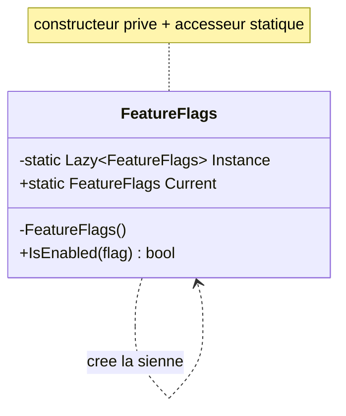

# Singleton

🌍 🇫🇷 Français (ce fichier) · 🇬🇧 [English](Singleton-en.md)

> Garantit qu'un type n'a qu'une seule instance, et fournit un point d'accès global à celle-ci.
>
> — Gamma, Helm, Johnson & Vlissides, *Design Patterns*, 1994

## Le problème

Certaines choses ne doivent exister qu'une fois dans un processus. Un registre de feature flags lu sur
disque au démarrage, un pool de connexions, un gestionnaire de fenêtres. En avoir deux ne serait pas
deux fois mieux — ils se contrediraient.

Il faut donc deux garanties à la fois : **une seule instance existe**, et **le code qui en a besoin
peut l'atteindre**. Le langage n'en offre aucune des deux. Un constructeur `public` autorise n'importe
qui à en fabriquer un second, et une instance unique bien élevée ne sert à rien si elle est enterrée à
trois constructeurs de l'endroit qui la réclame.

## La solution

Retirer le constructeur aux appelants et distribuer l'instance soi-même. Le type crée sa propre
instance unique, la garde dans un champ statique, et l'expose par un accesseur statique. Le
constructeur étant privé, la garantie est tenue par le compilateur plutôt que demandée dans un
commentaire.

Les deux garanties arrivent ensemble, et **c'est tout le pattern — ainsi que, on va le voir, son
problème central.**

## Structure



Une seule boîte. Singleton est le seul pattern du Gang of Four à n'avoir qu'un participant, ce qui
explique que l'annotation soit plate : `[Singleton]`, jamais `[Singleton.Singleton]`.

## Le rôle

| Rôle | Annotation | S'applique à | Ce qu'il porte |
|---|---|---|---|
| Singleton | `[Singleton]` | classe | Garantit qu'un type n'a qu'une seule instance, et fournit un point d'accès global à celle-ci. |

## L'exemple

Tiré de [`SingletonUsage.cs`](../../../../DesignPatternCatalog.Usage/GangOfFour/SingletonUsage.cs) —
un jeu de feature flags, lu une fois et interrogé souvent.

```csharp
[Singleton]
public sealed class FeatureFlags {
```

L'annotation dit ce que la classe promet. Rien ne l'impose — l'attribut ne porte aucun comportement —
mais une règle que tu écris peut désormais confronter la promesse au code : toute classe marquée
`[Singleton]` a un constructeur privé, sinon le build casse. C'est tout l'intérêt d'annoter plutôt que
de faire confiance à un commentaire.

```csharp
    private static readonly Lazy<FeatureFlags> Instance = new(() => new FeatureFlags());

    private FeatureFlags() { }

    public static FeatureFlags Current => Instance.Value;
```

Trois lignes, et chacune fait un travail.

`Lazy<T>` construit l'instance à la première lecture de `Current`, pas au chargement du type, et il est
**thread-safe par défaut** — plusieurs threads en concurrence sur `Current` obtiennent la même
instance, et la fabrique ne s'exécute qu'une fois. Avant `Lazy<T>`, c'est ce que les gens écrivaient à
la main et rataient ; le catalogue POSA2 tient un pattern entier sur les façons de le rater :
`DoubleCheckedLockingOptimization`.

`private FeatureFlags()` est ce qui rend la chose réelle. Sans lui, `new FeatureFlags()` compile
toujours partout et la classe n'est un singleton que par convention.

```csharp
    public bool IsEnabled(string flag) => false;
}
```

Remarque ce qui manque : **aucun état mutable**. Pas de `SetFlag`, pas de cache, pas de champ
mémorisant la dernière question. Ce n'est pas un hasard d'exemple court — c'est la discipline
qu'impose la durée de vie, et la section suivante parle de ce qui arrive quand elle manque.

## Quand l'utiliser

Le livre donne deux cas :

* **il doit exister exactement une instance, atteignable depuis un point connu** — et les deux moitiés
  doivent être vraies ;
* **l'instance unique doit pouvoir être étendue par héritage**, les clients utilisant l'instance
  étendue sans changer leur code.

En pratique, sur .NET, il gagne sa place quand tout ceci est vrai en même temps :

* la chose est réellement à l'échelle du processus — ni par requête, ni par locataire, ni par test ;
* elle est **immuable après construction**, ou sa mutation est sûre en concurrence ;
* la construire coûte assez cher pour que la construire deux fois se voie ;
* elle doit être atteignable depuis un endroit où un paramètre de constructeur ne va pas — un contexte
  statique, un générateur de source, un analyseur, une méthode d'extension.

Cette dernière condition est celle qui échoue d'ordinaire, et c'est celle qui compte.

## Quand ne pas l'utiliser

**Parce que « une seule instance » et « accès global » sont deux exigences distinctes, et que Singleton
les soude.** Presque toujours, on veut la première et pas la seconde. Un conteneur donne une instance
unique sans point d'accès global : on enregistre le type une fois, on le prend en paramètre de
constructeur, et on a la durée de vie sans l'accessibilité. C'est un autre pattern, sous un autre nom
— le catalogue `DependencyInjection` le tient sous `SingletonLifestyle` — et c'est le bon défaut.

Concrètement, ne sors pas Singleton quand :

* **un conteneur est disponible.** `SingletonLifestyle` donne la même durée de vie, et la dépendance
  apparaît dans le constructeur, où un lecteur et un test la voient.
* **les appelants y accéderaient statiquement.** Une classe qui appelle `FeatureFlags.Current` dans une
  méthode a une dépendance que sa signature ne déclare pas. Rien ne peut la substituer, donc rien ne
  peut tester la classe isolément. Le catalogue `DependencyInjection` nomme cette forme et la range en
  anti-pattern : `AmbientContext` pour le point d'accès statique, `ControlFreak` pour la classe qui
  tend le bras et se sert.
* **il porterait de l'état mutable.** Une instance pour tout le processus, c'est une instance pour
  chaque thread qui s'y trouve. Un champ qui mémorise la dernière requête est un champ partagé par
  tous ceux qui interrogeront un jour.
* **les tests ont besoin d'isolation.** Un état qui survit au processus survit à ta suite de tests : la
  mutation d'un test est l'état de départ du suivant, et l'échec apparaît dans celui qui passe en
  second.
* **il n'y en a qu'un aujourd'hui.** « Il n'y aura jamais qu'une seule base » est une phrase qui
  vieillit. Les multiplicités par locataire, par région, par test arrivent plus tard, et déraciner un
  accesseur statique de cent sites d'appel est bien plus dur que changer un enregistrement.

**Une note d'attribution.** Le livre énumère des bénéfices pour Singleton et aucun inconvénient. Tout
ce qui figure dans cette section au-delà des deux premiers points est le jugement accumulé par la
profession depuis 1994, et non celui de Gamma, Helm, Johnson et Vlissides. Il est présent parce qu'une
page qui ne rapporterait que la position de 1994 enverrait un lecteur vers un choix que l'industrie a
depuis largement inversé — mais les deux ne font pas la même autorité et ne doivent pas se lire comme
une seule.

## Ce qu'il coûte

**Ce que le livre lui reconnaît**

* un accès contrôlé à l'instance unique ;
* un espace de noms plus restreint que des variables globales ;
* la possibilité d'affiner ensuite l'opération et la représentation, par héritage ;
* la possibilité d'autoriser plus tard un nombre variable d'instances, en ne changeant que
  l'accesseur ;
* plus de souplesse que des méthodes statiques sur une classe, qu'on ne peut ni redéfinir ni
  substituer.

**Ce qu'il facture**

* la dépendance est invisible dans la signature de tout ce qui l'utilise ;
* la substituer — dans un test, pour un autre locataire, dans un second processus — oblige à changer
  chaque site d'appel, faute de couture ;
* la durée de vie est le processus : toute mutation est concurrente et toute fuite est définitive ;
* l'état traverse les frontières de tests, et les échecs qui en résultent dépendent de l'ordre.

## Patterns qu'on confond avec lui

| | |
|---|---|
| **`SingletonLifestyle`** (Dependency Injection) | La même durée de vie, rien de l'accès global. Un conteneur détient une instance et la distribue par les constructeurs. **C'est ce que la plupart des gens veulent dire aujourd'hui en disant « singleton »**, et les deux catalogues tiennent les deux parce que les œuvres sont en désaccord. |
| **Une classe statique** | Également atteignable de partout, également unique — mais elle ne peut ni implémenter une interface, ni être héritée, ni être passée en paramètre, ni être substituée. Singleton laisse ces portes ouvertes ; une classe statique les ferme. |
| **`AmbientContext`** (Dependency Injection) | Un point d'accès statique à une dépendance. Le mécanisme qu'offre Singleton, considéré comme une façon d'*obtenir ses collaborateurs* — et refusé sur ce terrain par l'œuvre qui le nomme. |
| **Monostate** | Absent de ce catalogue. Plusieurs instances partageant un état statique : l'accès est normal, l'état est unique. L'inverse de ce que fait Singleton. |

`AbstractFactory`, `Builder` et `Prototype` sont souvent *implémentés* en singletons — un objet
fabrique sert toute une application — ce qui est un usage de ce pattern plutôt qu'un concurrent.

## D'où cela vient

*Design Patterns: Elements of Reusable Object-Oriented Software*, Gamma, Helm, Johnson & Vlissides,
Addison-Wesley, 1994 — chapitre des patterns de création.

* [Entrée d'index](../../../generated/catalog-index.md#singleton-gang-of-four) — l'annotation, la
  cible, les liens.
* [Attribut généré](../../../../DesignPatternCatalog.GangOfFour/Singleton.cs)
* [Exemple](../../../../DesignPatternCatalog.Usage/GangOfFour/SingletonUsage.cs)
