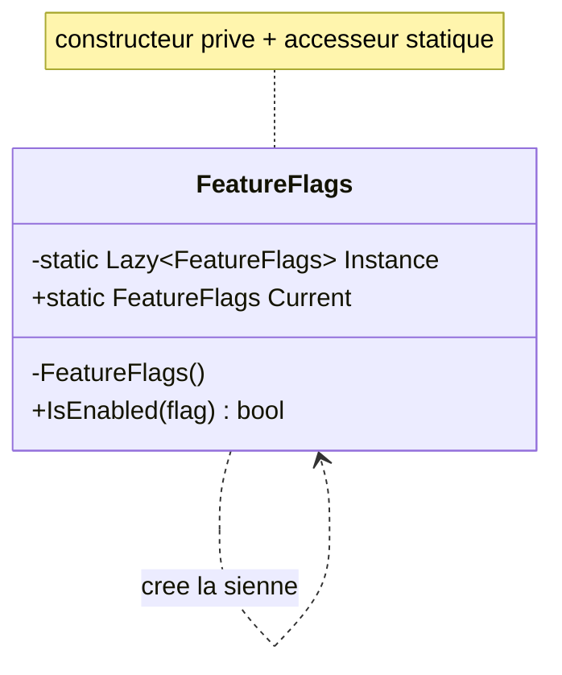

# Singleton

🌍 🇫🇷 Français (ce fichier) · 🇬🇧 [English](Singleton-en.md)

## Intention

Singleton est un patron de création qui garantit qu'un type n'a qu'une seule instance, et qui fournit
un point d'accès global à celle-ci.

## Problème

Certaines choses ne doivent exister qu'une fois dans un processus : un registre de feature flags lu sur
disque au démarrage, un pool de connexions, un gestionnaire de fenêtres. Deux exemplaires ne seraient
pas deux fois meilleurs, ils se contrediraient.

Deux garanties sont donc nécessaires en même temps. Une seule instance doit exister, et le code qui en
a besoin doit pouvoir l'atteindre. Le langage n'offre ni l'une ni l'autre : un constructeur `public`
autorise n'importe qui à en fabriquer un second, et une instance unique bien tenue ne sert à rien si
elle se trouve à trois constructeurs de l'endroit qui la réclame.

## Solution

Le patron retire le constructeur aux appelants et distribue l'instance lui-même. Le type crée sa propre
instance unique, la garde dans un champ statique, et l'expose par un accesseur statique. Comme le
constructeur est privé, l'unicité est tenue par le compilateur et non demandée dans un commentaire.

Les deux garanties arrivent ensemble. C'est l'ensemble du patron, et c'est aussi son problème central.

## Structure



Une seule boîte. Singleton est le seul patron du Gang of Four à n'avoir qu'un participant, ce qui
explique que l'annotation soit plate : `[Singleton]`, et non `[Singleton.Singleton]`.

## Le rôle

| Rôle | Annotation | S'applique à | Ce qu'il porte |
|---|---|---|---|
| Singleton | `[Singleton]` | classe | Garantit qu'un type n'a qu'une seule instance, et fournit un point d'accès global à celle-ci. |

## L'exemple

Extrait de [`SingletonUsage.cs`](../../../../DesignPatternCatalog.Usage/GangOfFour/SingletonUsage.cs) :
un jeu de feature flags, lu une fois et interrogé souvent.

```csharp
[Singleton]
public sealed class FeatureFlags {
```

L'annotation énonce ce que la classe promet. Elle ne l'impose pas — l'attribut ne porte aucun
comportement — mais une règle d'architecture peut confronter la promesse au code : toute classe marquée
`[Singleton]` a un constructeur privé, sinon le build échoue.

```csharp
    private static readonly Lazy<FeatureFlags> Instance = new(() => new FeatureFlags());

    private FeatureFlags() { }

    public static FeatureFlags Current => Instance.Value;
```

`Lazy<T>` construit l'instance à la première lecture de `Current`, et non au chargement du type. Il est
thread-safe par défaut : plusieurs threads en concurrence sur `Current` obtiennent la même instance et
la fabrique ne s'exécute qu'une fois. Avant `Lazy<T>`, cette mécanique s'écrivait à la main, et le
catalogue POSA2 tient un patron entier consacré aux façons de la rater :
`DoubleCheckedLockingOptimization`.

Le constructeur privé est ce qui rend l'unicité effective. Sans lui, `new FeatureFlags()` compile
partout et l'unicité n'est plus qu'une convention.

```csharp
    public bool IsEnabled(string flag) => false;
}
```

La classe ne porte aucun état mutable : ni `SetFlag`, ni cache, ni champ mémorisant la dernière
interrogation. Ce n'est pas une simplification d'exemple, c'est la discipline qu'impose la durée de vie
— la section suivante décrit ce qui se produit lorsqu'elle manque.

## Possibilités d'application

**Utilisez Singleton lorsqu'il doit exister exactement une instance et qu'elle doit être atteignable
depuis un point connu.** Les deux moitiés de la phrase doivent être vraies, et c'est la seconde qui
échoue le plus souvent.

**Utilisez Singleton lorsque l'instance unique doit pouvoir être étendue par héritage**, les clients
utilisant l'instance étendue sans modifier leur code.

Sur .NET, le patron gagne sa place quand ces conditions sont réunies :

* la chose est réellement à l'échelle du processus, ni par requête, ni par locataire, ni par test ;
* elle est immuable après construction, ou sa mutation est sûre en concurrence ;
* sa construction coûte assez cher pour que la faire deux fois se remarque ;
* elle doit être atteignable depuis un endroit qu'un paramètre de constructeur n'atteint pas : un
  contexte statique, un générateur de source, un analyseur, une méthode d'extension.

## Quand ne pas l'utiliser

« Une seule instance » et « accès global » sont deux exigences distinctes, et Singleton les soude.
Presque toujours, seule la première est voulue. Un conteneur d'injection fournit une instance unique
sans point d'accès global : le type est enregistré une fois et pris en paramètre de constructeur. Le
catalogue `DependencyInjection` tient cette variante sous `SingletonLifestyle`, et c'est le défaut
raisonnable.

**N'utilisez pas Singleton quand un conteneur est disponible.** `SingletonLifestyle` donne la même
durée de vie, et la dépendance apparaît dans le constructeur, où un lecteur et un test la voient.

**N'utilisez pas Singleton si les appelants y accéderont statiquement.** Une classe qui appelle
`FeatureFlags.Current` au milieu d'une méthode possède une dépendance que sa signature ne déclare pas.
Rien ne peut la substituer, donc rien ne peut tester la classe isolément. Le catalogue
`DependencyInjection` range cette forme en anti-patron : `AmbientContext` pour le point d'accès
statique, `ControlFreak` pour la classe qui va chercher elle-même ses collaborateurs.

**N'utilisez pas Singleton pour porter de l'état mutable.** Une instance pour tout le processus est une
instance pour chacun de ses threads. Un champ qui mémorise la dernière requête est un champ partagé par
tous les appelants.

**N'utilisez pas Singleton lorsque les tests ont besoin d'isolation.** Un état qui survit au processus
survit à la suite de tests : la mutation d'un test devient l'état initial du suivant, et l'échec se
manifeste dans celui qui s'exécute en second.

**N'utilisez pas Singleton au seul motif qu'il n'y en a qu'un aujourd'hui.** Les multiplicités par
locataire, par région ou par test arrivent plus tard, et déraciner un accesseur statique de cent sites
d'appel coûte bien plus que modifier un enregistrement.

### Attribution

Le livre énumère des avantages pour Singleton et aucun inconvénient. Tout ce qui figure dans cette
section, hormis les deux conditions d'application, relève du jugement accumulé par la profession depuis
1994 et non de celui de Gamma, Helm, Johnson et Vlissides. Ces éléments sont présents parce qu'une page
qui ne rapporterait que la position de 1994 orienterait un lecteur vers un choix que l'industrie a
depuis largement inversé — mais les deux ne font pas la même autorité.

## Avantages

* L'accès à l'instance unique est contrôlé.
* L'espace de noms reste plus restreint qu'avec des variables globales.
* L'opération et la représentation peuvent être affinées plus tard, par héritage.
* Un nombre variable d'instances peut être autorisé plus tard en ne modifiant que l'accesseur.
* Le patron est plus souple que des méthodes statiques, qui ne peuvent être ni redéfinies ni
  substituées.

## Inconvénients

* La dépendance est invisible dans la signature de tout ce qui l'utilise.
* La substituer — dans un test, pour un autre locataire, dans un second processus — impose de modifier
  chaque site d'appel, faute de couture.
* La durée de vie étant le processus, toute mutation est concurrente et toute fuite est définitive.
* L'état traverse les frontières de tests, et les échecs qui en découlent dépendent de l'ordre
  d'exécution.

## Liens avec les autres patrons

**`SingletonLifestyle`** (Dependency Injection) offre la même durée de vie sans l'accès global : un
conteneur détient une instance et la distribue par les constructeurs. C'est le sens que la plupart des
développeurs donnent aujourd'hui au mot « singleton », et les deux catalogues tiennent les deux entrées
parce que leurs œuvres sont en désaccord.

**Une classe statique** est également unique et atteignable de partout, mais elle ne peut ni
implémenter une interface, ni être héritée, ni être passée en paramètre, ni être substituée. Singleton
laisse ces portes ouvertes.

**`AmbientContext`** (Dependency Injection) est le même mécanisme d'accès statique, considéré comme une
façon d'obtenir ses collaborateurs — et refusé sur ce terrain par l'œuvre qui le nomme.

**Monostate**, absent de ce catalogue, partage un état statique entre plusieurs instances : l'accès est
ordinaire, l'état est unique. C'est l'inverse de Singleton.

`AbstractFactory`, `Builder` et `Prototype` sont souvent implémentés en singletons, un objet fabrique
servant toute une application.

## Source

*Design Patterns: Elements of Reusable Object-Oriented Software*, Gamma, Helm, Johnson & Vlissides,
Addison-Wesley, 1994 — chapitre des patrons de création.

* [Entrée d'index](../../../generated/catalog-index.md#singleton-gang-of-four)
* [Attribut généré](../../../../DesignPatternCatalog.GangOfFour/Singleton.cs)
* [Exemple](../../../../DesignPatternCatalog.Usage/GangOfFour/SingletonUsage.cs)
