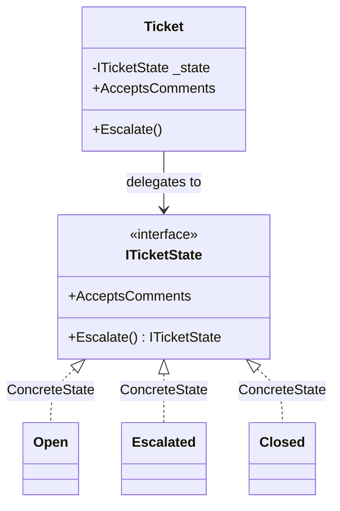

# State

🌍 🇬🇧 English (this file) · 🇫🇷 [Français](State-fr.md)

## Intent

State is a behavioural pattern that lets an object alter its behaviour when its internal state changes, so
that it appears to change its class.

## Problem

A support ticket behaves differently depending on where it is. An open ticket accepts comments and can be
escalated. An escalated one accepts comments and cannot be escalated further. A closed one accepts
nothing, and escalating it reopens it.

Written as flags, every operation repeats the same test:

```csharp
public bool AcceptsComments => _status != Status.Closed;

public void Escalate() {
    if (_status == Status.Closed)   { _status = Status.Open;      return; }
    if (_status == Status.Open)     { _status = Status.Escalated; return; }
}
```

The rules of each status are spread across every method, so answering "what can a closed ticket do" means
reading the whole class, and adding a status means revisiting all of it.

## Solution

The pattern gives each state an object.

One interface declares the behaviour that varies. One implementation per state answers it the way that
state answers it. The ticket holds the current one and delegates, so its own methods stop testing and the
rules of a status are gathered in the class named after it.

## Structure



## The roles

| Role | Annotation | Applies to | What it carries |
|---|---|---|---|
| State | `[State.State]` | interface, class | Declares the behaviour that varies with the state of the context. |
| ConcreteState | `[State.ConcreteState]` | class, struct | Implements the behaviour associated with one state of the context. |
| Context | `[State.Context]` | class | Holds the current state, and delegates the state dependent behaviour to it. |

## The example

From [`StateUsage.cs`](../../../../DesignPatternCatalog.Usage/GangOfFour/StateUsage.cs).

```csharp
[State.State]
public interface ITicketState {
    ITicketState Escalate();
    bool         AcceptsComments { get; }
}
```

`Escalate` returns a state rather than returning nothing. That signature is the design decision of this
sample: the states decide the transitions, and the context only stores the answer.

```csharp
[State.ConcreteState(State = typeof(ITicketState))]
public sealed class Open : ITicketState {
    public ITicketState Escalate()      => new Escalated();
    public bool         AcceptsComments => true;
}

[State.ConcreteState(State = typeof(ITicketState))]
public sealed class Escalated : ITicketState {
    public ITicketState Escalate()      => this;
    public bool         AcceptsComments => true;
}

[State.ConcreteState(State = typeof(ITicketState))]
public sealed class Closed : ITicketState {
    public ITicketState Escalate()      => new Open();
    public bool         AcceptsComments => false;
}
```

Three states, and the whole transition table readable in nine lines. `Escalated` returns `this` — an
escalation that changes nothing is expressed as a transition to itself rather than as a special case —
and `Closed` reopens, which is a business rule that would have been a branch in a conditional and is here
a line in the class it belongs to.

The book discusses who should decide transitions. Putting them in the states, as here, keeps each rule
next to the behaviour it accompanies, at the cost of coupling the states to one another: `Open` names
`Escalated`, so the set is no longer open to extension without editing its members.

```csharp
[State.Context(State = typeof(ITicketState))]
public sealed class Ticket {

    private ITicketState _state = new Open();

    public bool AcceptsComments => _state.AcceptsComments;

    public void Escalate() => _state = _state.Escalate();

}
```

The context after the pattern: no conditional, no status field, no rule. It holds a state and forwards.

## Applicability

**Use State when an object's behaviour depends on its state and it must change that behaviour at run
time.**

**Use State when operations have large multipart conditional statements that depend on the object's
state**, especially where the same condition appears in several operations.

## When not to use it

**Do not use State for two states and one transition.** A boolean and an `if` are readable; three classes
and an interface for the same thing are not.

**Do not use State where the states need shared mutable data.** Each state object is separate, so
anything they all read has to live in the context and be passed or exposed — and exposing it is how a
context ends up with public members that exist only for its states.

**Do not use State where the transition graph is the thing being designed.** Where the interesting
questions are *which transitions are legal*, *what happens on an illegal one* and *what fires on entry*,
the answers are scattered across the state classes and no single place shows the machine. An explicit
transition table, or a state-machine library, keeps that visible.

**Do not use State where the states are values.** A status persisted in a database, sent over an API or
compared for equality wants an enum; a state object is behaviour, and the two are not interchangeable
without a mapping that has to be written and kept.

## Advantages

* The behaviour of one state is gathered in one class, so the answer to "what does a closed ticket do" is
  a file rather than a search.
* Conditionals disappear from the context, and adding a state adds a class rather than a branch in every
  method.
* State transitions become explicit: they are operations that return a state, not assignments buried in
  a method.

## Drawbacks

* A class per state, which is a lot of ceremony for a small machine.
* States that decide their own transitions know each other, so the set is closed in practice.
* An object per transition unless the states are shared, and sharing them requires them to be stateless.

## Relations with other patterns

**`Strategy`** has the same structure. The intents differ: a strategy is chosen by the client and its
implementations ignore one another; a state is chosen by the object as its situation changes, and the
states usually name each other.

**`Flyweight`** applies where the states hold nothing of their own: one instance per state can then be
shared by every context, instead of one per transition.

**`Singleton`** is how state objects are often shared in the book's own discussion, with the reservations
that pattern's page sets out.

## Source

*Design Patterns: Elements of Reusable Object-Oriented Software*, Gamma, Helm, Johnson & Vlissides,
Addison-Wesley, 1994 — the behavioural patterns chapter.

* [Index entry](../../../generated/catalog-index.md#state-gang-of-four)
* [Generated attribute](../../../../DesignPatternCatalog.GangOfFour/State.cs)
* [Sample](../../../../DesignPatternCatalog.Usage/GangOfFour/StateUsage.cs)
