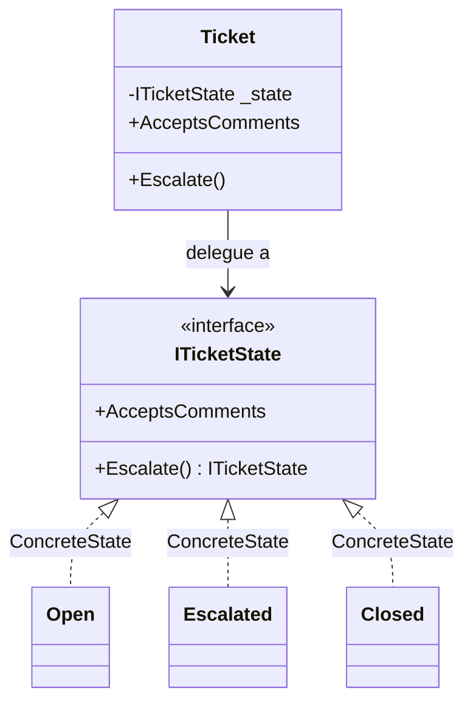

# State

🌍 🇫🇷 Français (ce fichier) · 🇬🇧 [English](State-en.md)

## Intention

State est un patron comportemental qui permet à un objet de modifier son comportement lorsque son état
interne change, de sorte qu'il paraisse changer de classe.

## Problème

Un ticket de support se comporte différemment selon l'endroit où il en est. Un ticket ouvert accepte des
commentaires et peut être escaladé. Un ticket escaladé accepte des commentaires et ne peut pas l'être
davantage. Un ticket clos n'accepte rien, et l'escalader le rouvre.

Écrit avec des drapeaux, chaque opération répète le même test :

```csharp
public bool AcceptsComments => _status != Status.Closed;

public void Escalate() {
    if (_status == Status.Closed)   { _status = Status.Open;      return; }
    if (_status == Status.Open)     { _status = Status.Escalated; return; }
}
```

Les règles de chaque statut sont réparties sur toutes les méthodes : répondre à « que peut faire un ticket
clos » oblige à lire la classe entière, et ajouter un statut à la revisiter tout entière.

## Solution

Le patron donne un objet à chaque état.

Une interface déclare le comportement qui varie. Une implémentation par état y répond comme cet état y
répond. Le ticket détient l'état courant et délègue : ses propres méthodes cessent de tester, et les
règles d'un statut se rassemblent dans la classe qui porte son nom.

## Structure



## Les rôles

| Rôle | Annotation | S'applique à | Ce qu'il porte |
|---|---|---|---|
| State | `[State.State]` | interface, classe | Déclare le comportement qui varie avec l'état du contexte. |
| ConcreteState | `[State.ConcreteState]` | classe, struct | Implémente le comportement associé à un état du contexte. |
| Context | `[State.Context]` | classe | Détient l'état courant, et lui délègue le comportement qui en dépend. |

## L'exemple

Extrait de [`StateUsage.cs`](../../../../DesignPatternCatalog.Usage/GangOfFour/StateUsage.cs).

```csharp
[State.State]
public interface ITicketState {
    ITicketState Escalate();
    bool         AcceptsComments { get; }
}
```

`Escalate` rend un état au lieu de ne rien rendre. Cette signature est la décision de conception de
l'exemple : ce sont les états qui décident des transitions, et le contexte ne fait que stocker la
réponse.

```csharp
[State.ConcreteState(State = typeof(ITicketState))]
public sealed class Open : ITicketState {
    public ITicketState Escalate()      => new Escalated();
    public bool         AcceptsComments => true;
}

[State.ConcreteState(State = typeof(ITicketState))]
public sealed class Escalated : ITicketState {
    public ITicketState Escalate()      => this;
    public bool         AcceptsComments => true;
}

[State.ConcreteState(State = typeof(ITicketState))]
public sealed class Closed : ITicketState {
    public ITicketState Escalate()      => new Open();
    public bool         AcceptsComments => false;
}
```

Trois états, et toute la table des transitions lisible en neuf lignes. `Escalated` rend `this` — une
escalade sans effet s'exprime en transition vers soi-même plutôt qu'en cas particulier — et `Closed`
rouvre, règle métier qui aurait été une branche dans une conditionnelle et qui est ici une ligne dans la
classe à laquelle elle appartient.

Le livre discute de qui doit décider des transitions. Les placer dans les états, comme ici, garde chaque
règle auprès du comportement qu'elle accompagne, au prix d'un couplage entre états : `Open` nomme
`Escalated`, si bien que l'ensemble n'est plus extensible sans modifier ses membres.

```csharp
[State.Context(State = typeof(ITicketState))]
public sealed class Ticket {

    private ITicketState _state = new Open();

    public bool AcceptsComments => _state.AcceptsComments;

    public void Escalate() => _state = _state.Escalate();

}
```

Le contexte après le patron : aucune conditionnelle, aucun champ de statut, aucune règle. Il détient un
état et transmet.

## Possibilités d'application

**Utilisez State lorsque le comportement d'un objet dépend de son état et qu'il doit en changer à
l'exécution.**

**Utilisez State lorsque des opérations comportent de vastes conditionnelles à plusieurs branches
dépendant de l'état de l'objet**, en particulier lorsque la même condition réapparaît dans plusieurs
opérations.

## Quand ne pas l'utiliser

**N'utilisez pas State pour deux états et une transition.** Un booléen et un `if` se lisent ; trois classes
et une interface pour la même chose, non.

**N'utilisez pas State là où les états ont besoin de données mutables communes.** Chaque objet-état est
distinct : tout ce qu'ils lisent tous doit vivre dans le contexte et leur être transmis ou exposé — et
l'exposer est la façon dont un contexte finit avec des membres publics qui n'existent que pour ses états.

**N'utilisez pas State là où le graphe de transitions est ce qu'on conçoit.** Lorsque les questions
intéressantes sont *quelles transitions sont licites*, *que se passe-t-il sur une transition illicite* et
*qu'est-ce qui se déclenche à l'entrée*, les réponses sont dispersées dans les classes d'états et aucun
endroit unique ne montre la machine. Une table de transitions explicite, ou une bibliothèque de machines à
états, garde cela visible.

**N'utilisez pas State là où les états sont des valeurs.** Un statut persisté en base, envoyé par une API
ou comparé pour égalité veut une énumération ; un objet-état est du comportement, et les deux ne sont pas
interchangeables sans une correspondance qu'il faut écrire et tenir.

## Avantages

* Le comportement d'un état se rassemble dans une classe : la réponse à « que fait un ticket clos » est un
  fichier plutôt qu'une recherche.
* Les conditionnelles disparaissent du contexte, et ajouter un état ajoute une classe au lieu d'une
  branche dans chaque méthode.
* Les transitions deviennent explicites : ce sont des opérations qui rendent un état, non des affectations
  enfouies dans une méthode.

## Inconvénients

* Une classe par état, ce qui fait beaucoup de cérémonial pour une petite machine.
* Des états qui décident de leurs propres transitions se connaissent : l'ensemble est clos en pratique.
* Un objet par transition, à moins de partager les états, ce qui exige qu'ils soient sans état.

## Liens avec les autres patrons

**`Strategy`** a la même structure. Les intentions diffèrent : une stratégie est choisie par le client et
ses implémentations s'ignorent ; un état est choisi par l'objet à mesure que sa situation change, et les
états se nomment d'ordinaire les uns les autres.

**`Flyweight`** s'applique là où les états ne détiennent rien en propre : une instance par état peut alors
être partagée par tous les contextes, au lieu d'une par transition.

**`Singleton`** est la façon dont les objets-états sont souvent partagés dans la discussion même du livre,
avec les réserves qu'expose la page de ce patron.

## Source

*Design Patterns: Elements of Reusable Object-Oriented Software*, Gamma, Helm, Johnson & Vlissides,
Addison-Wesley, 1994 — chapitre des patrons comportementaux.

* [Entrée d'index](../../../generated/catalog-index.md#state-gang-of-four)
* [Attribut généré](../../../../DesignPatternCatalog.GangOfFour/State.cs)
* [Exemple](../../../../DesignPatternCatalog.Usage/GangOfFour/StateUsage.cs)
