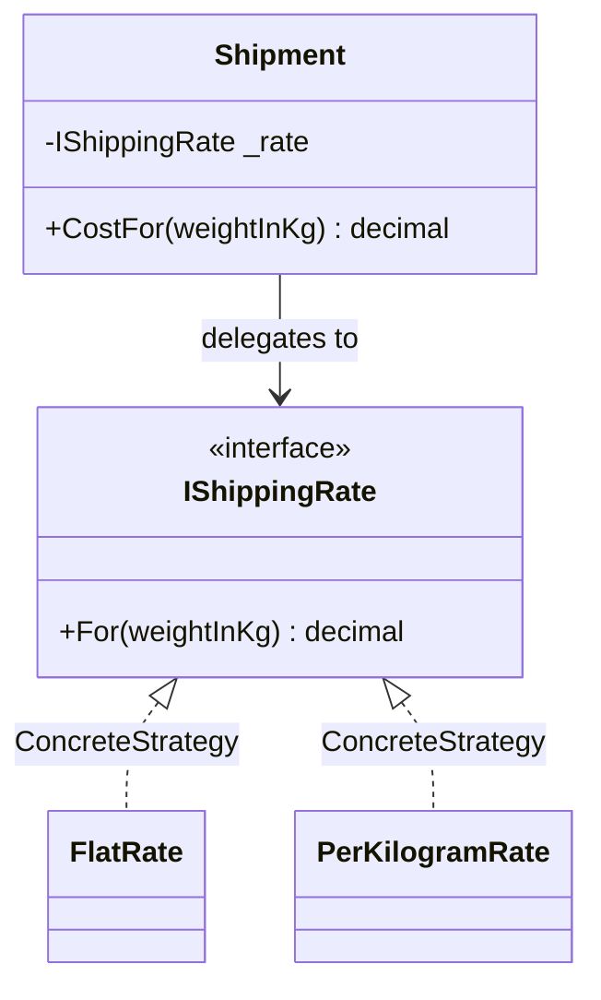

# Strategy

🌍 🇬🇧 English (this file) · 🇫🇷 [Français](Strategy-fr.md)

## Intent

Strategy is a behavioural pattern that defines a family of interchangeable algorithms, encapsulates each
one, and lets the algorithm vary independently from the clients that use it.

## Problem

Shipping is charged differently depending on the contract: a flat fee for one carrier, a price per
kilogram for another, a banded table for a third.

Written as a conditional, the shipment class accumulates every carrier's rules:

```csharp
decimal cost = _carrier switch {
    "flat"    => 9.90m,
    "perKilo" => 2.50m * weight,
    _         => throw new NotSupportedException()
};
```

A new carrier means editing a class that has nothing to do with carriers, and every rule is visible to
everyone that reads the shipment.

## Solution

The pattern makes the varying part an object.

One interface declares the question — what does this weight cost — and one implementation answers it per
carrier. The shipment holds the interface and delegates. Adding a carrier adds a class; the shipment is
never edited again, and each rule is testable on its own.

## Structure



## The roles

| Role | Annotation | Applies to | What it carries |
|---|---|---|---|
| Strategy | `[Strategy.Strategy]` | interface, class | Declares the interface common to every supported algorithm. |
| ConcreteStrategy | `[Strategy.ConcreteStrategy]` | class, struct | Implements one algorithm behind the strategy interface. |
| Context | `[Strategy.Context]` | class | Is configured with a strategy, and delegates the algorithm to it. |

## The example

From [`StrategyUsage.cs`](../../../../DesignPatternCatalog.Usage/GangOfFour/StrategyUsage.cs).

```csharp
[Strategy.Strategy]
public interface IShippingRate {
    decimal For(decimal weightInKg);
}
```

One question, and nothing else. The narrower this interface, the more algorithms can satisfy it.

```csharp
[Strategy.ConcreteStrategy(Strategy = typeof(IShippingRate))]
public readonly record struct FlatRate(decimal Price) : IShippingRate {
    public decimal For(decimal weightInKg) => Price;
}

[Strategy.ConcreteStrategy(Strategy = typeof(IShippingRate))]
public readonly record struct PerKilogramRate(decimal PricePerKg) : IShippingRate {
    public decimal For(decimal weightInKg) => PricePerKg * weightInKg;
}
```

Each rule carries its own parameters. A strategy holding data is the usual case, and it is why the
pattern is more than a delegate.

Both are declared `readonly record struct`, which the catalogue permits — `ConcreteStrategy` applies to a
struct as well as a class. Storing one in a field typed as the interface boxes it, so the allocation the
struct was chosen to avoid happens anyway at the point of assignment.

```csharp
[Strategy.Context(Strategy = typeof(IShippingRate))]
public sealed class Shipment {

    private readonly IShippingRate _rate;

    public Shipment(IShippingRate rate) { _rate = rate; }

    public decimal CostFor(decimal weightInKg) => _rate.For(weightInKg);

}
```

The context takes its strategy through the constructor and never names a concrete one. The choice is
made by whoever builds the shipment, which is the property that makes the algorithm vary independently
of the client.

## Applicability

**Use Strategy when many related classes differ only in their behaviour**, so that one class can be
configured with one behaviour among several.

**Use Strategy when several variants of an algorithm are needed** — the trade between speed and space
being the book's own example.

**Use Strategy when an algorithm uses data that clients should not know about.**

**Use Strategy when a class defines many behaviours that appear as multiple conditionals** in its
operations: each branch of the conditional becomes a strategy.

## When not to use it

**Do not use Strategy where a delegate suffices.** A strategy that holds no data and declares one method
is `Func<decimal, decimal>` on .NET, and passing a lambda costs no type, no file and no annotation. The
pattern earns its interface when the algorithm carries state, needs a name, or has more than one member.

**Do not use Strategy where the algorithm never varies.** One implementation behind an interface is an
indirection with no second case to justify it.

**Do not use Strategy where the context must hand over data the algorithm does not need.** The book names
this cost directly: a common interface obliges every strategy to accept what any of them might want, so
the simple ones receive parameters they ignore.

**Do not use Strategy where clients cannot be expected to choose.** The pattern requires the caller to
know which strategy is appropriate, and a client without that knowledge is better served by a factory or
by a decision made in the composition root.

## Advantages

* A family of related algorithms is expressed as a hierarchy, and common behaviour can be factored into
  it.
* Conditionals disappear: each branch becomes a class, and adding one touches nothing existing.
* The algorithm is chosen at run time, and can be swapped for one caller without affecting another.

## Drawbacks

* Clients must know how the strategies differ in order to choose one.
* The communication between context and strategy is fixed by the interface, so simple strategies pay for
  the needs of complex ones.
* The design gains objects: a strategy with no state is an object where a function would do.

## Relations with other patterns

**`State`** has the same diagram and a different intent. A state is chosen by the object itself as its
situation changes and the states usually know one another; a strategy is chosen by the client and the
strategies never do.

**`Decorator`** changes the skin of an object where a strategy changes its guts, in the book's own
phrasing.

**`Bridge`** looks identical from the outside; the difference is that a bridge exists so the abstraction
can also be subclassed, where a strategy varies behind a fixed context.

**`Flyweight`** often applies: a stateless strategy holds nothing of its own and can be shared by every
context.

**`TemplateMethod`** varies steps by inheritance where Strategy varies a whole algorithm by composition.

## Source

*Design Patterns: Elements of Reusable Object-Oriented Software*, Gamma, Helm, Johnson & Vlissides,
Addison-Wesley, 1994 — the behavioural patterns chapter.

* [Index entry](../../../generated/catalog-index.md#strategy-gang-of-four)
* [Generated attribute](../../../../DesignPatternCatalog.GangOfFour/Strategy.cs)
* [Sample](../../../../DesignPatternCatalog.Usage/GangOfFour/StrategyUsage.cs)
