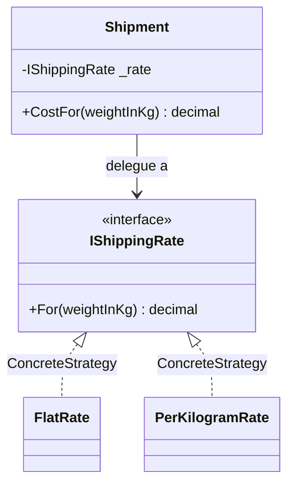

# Strategy

🌍 🇫🇷 Français (ce fichier) · 🇬🇧 [English](Strategy-en.md)

## Intention

Strategy est un patron comportemental qui définit une famille d'algorithmes interchangeables, encapsule
chacun d'eux, et laisse l'algorithme varier indépendamment des clients qui l'utilisent.

## Problème

Le transport se facture différemment selon le contrat : un forfait chez un transporteur, un prix au
kilogramme chez un autre, un barème par tranches chez un troisième.

Écrit en conditionnelle, la classe d'expédition accumule les règles de tous les transporteurs :

```csharp
decimal cost = _carrier switch {
    "flat"    => 9.90m,
    "perKilo" => 2.50m * weight,
    _         => throw new NotSupportedException()
};
```

Un nouveau transporteur oblige à modifier une classe qui n'a rien à voir avec les transporteurs, et
chaque règle est visible de quiconque lit l'expédition.

## Solution

Le patron fait de la partie variable un objet.

Une interface déclare la question — combien coûte ce poids — et une implémentation y répond par
transporteur. L'expédition détient l'interface et délègue. Ajouter un transporteur ajoute une classe ;
l'expédition n'est plus jamais modifiée, et chaque règle se teste seule.

## Structure



## Les rôles

| Rôle | Annotation | S'applique à | Ce qu'il porte |
|---|---|---|---|
| Strategy | `[Strategy.Strategy]` | interface, classe | Déclare l'interface commune à tous les algorithmes pris en charge. |
| ConcreteStrategy | `[Strategy.ConcreteStrategy]` | classe, struct | Implémente un algorithme derrière l'interface de stratégie. |
| Context | `[Strategy.Context]` | classe | Est configuré avec une stratégie, et lui délègue l'algorithme. |

## L'exemple

Extrait de [`StrategyUsage.cs`](../../../../DesignPatternCatalog.Usage/GangOfFour/StrategyUsage.cs).

```csharp
[Strategy.Strategy]
public interface IShippingRate {
    decimal For(decimal weightInKg);
}
```

Une question, et rien d'autre. Plus cette interface est étroite, plus d'algorithmes peuvent la
satisfaire.

```csharp
[Strategy.ConcreteStrategy(Strategy = typeof(IShippingRate))]
public readonly record struct FlatRate(decimal Price) : IShippingRate {
    public decimal For(decimal weightInKg) => Price;
}

[Strategy.ConcreteStrategy(Strategy = typeof(IShippingRate))]
public readonly record struct PerKilogramRate(decimal PricePerKg) : IShippingRate {
    public decimal For(decimal weightInKg) => PricePerKg * weightInKg;
}
```

Chaque règle porte ses propres paramètres. Une stratégie qui détient des données est le cas ordinaire, et
c'est pourquoi le patron est plus qu'un délégué.

Les deux sont déclarées `readonly record struct`, ce que le catalogue autorise — `ConcreteStrategy`
s'applique à une struct comme à une classe. En stocker une dans un champ typé par l'interface la boxe :
l'allocation que la struct devait éviter a lieu quand même, au moment de l'affectation.

```csharp
[Strategy.Context(Strategy = typeof(IShippingRate))]
public sealed class Shipment {

    private readonly IShippingRate _rate;

    public Shipment(IShippingRate rate) { _rate = rate; }

    public decimal CostFor(decimal weightInKg) => _rate.For(weightInKg);

}
```

Le contexte reçoit sa stratégie par le constructeur et ne nomme jamais de classe concrète. Le choix
revient à celui qui construit l'expédition, propriété qui fait varier l'algorithme indépendamment du
client.

## Possibilités d'application

**Utilisez Strategy lorsque de nombreuses classes apparentées ne diffèrent que par leur comportement**,
de sorte qu'une classe puisse être configurée avec l'un de plusieurs comportements.

**Utilisez Strategy lorsque plusieurs variantes d'un algorithme sont nécessaires** — l'arbitrage entre
vitesse et espace étant l'exemple du livre.

**Utilisez Strategy lorsqu'un algorithme emploie des données que les clients n'ont pas à connaître.**

**Utilisez Strategy lorsqu'une classe définit de nombreux comportements apparaissant sous forme de
conditionnelles multiples** : chaque branche devient une stratégie.

## Quand ne pas l'utiliser

**N'utilisez pas Strategy là où un délégué suffit.** Une stratégie sans données déclarant une seule
méthode, c'est `Func<decimal, decimal>` sur .NET, et passer une lambda ne coûte ni type, ni fichier, ni
annotation. Le patron gagne son interface quand l'algorithme porte de l'état, mérite un nom, ou compte
plus d'un membre.

**N'utilisez pas Strategy là où l'algorithme ne varie jamais.** Une implémentation derrière une interface
est une indirection sans second cas pour la justifier.

**N'utilisez pas Strategy là où le contexte doit transmettre des données dont l'algorithme n'a pas
besoin.** Le livre nomme ce coût directement : une interface commune oblige chaque stratégie à accepter
ce que l'une d'elles pourrait vouloir, si bien que les plus simples reçoivent des paramètres qu'elles
ignorent.

**N'utilisez pas Strategy là où les clients ne peuvent pas raisonnablement choisir.** Le patron exige de
l'appelant qu'il sache quelle stratégie convient ; un client dépourvu de ce savoir est mieux servi par
une fabrique ou par une décision prise à la racine de composition.

## Avantages

* Une famille d'algorithmes apparentés s'exprime en hiérarchie, et le comportement commun peut y être
  factorisé.
* Les conditionnelles disparaissent : chaque branche devient une classe, et en ajouter une ne touche à
  rien d'existant.
* L'algorithme est choisi à l'exécution, et peut être échangé pour un appelant sans affecter un autre.

## Inconvénients

* Les clients doivent savoir en quoi les stratégies diffèrent pour en choisir une.
* La communication entre contexte et stratégie est figée par l'interface : les stratégies simples paient
  pour les besoins des complexes.
* La conception gagne des objets : une stratégie sans état est un objet là où une fonction suffirait.

## Liens avec les autres patrons

**`State`** a le même diagramme et une autre intention. Un état est choisi par l'objet lui-même à mesure
que sa situation change, et les états se connaissent d'ordinaire ; une stratégie est choisie par le
client, et les stratégies ne se connaissent jamais.

**`Decorator`** change la peau d'un objet là où une stratégie en change les entrailles, selon la formule
du livre.

**`Bridge`** paraît identique de l'extérieur ; la différence est qu'un pont existe pour que l'abstraction
puisse aussi être héritée, là où une stratégie varie derrière un contexte fixe.

**`Flyweight`** s'applique souvent : une stratégie sans état ne détient rien en propre et peut être
partagée par tous les contextes.

**`TemplateMethod`** fait varier des étapes par héritage là où Strategy fait varier un algorithme entier
par composition.

## Source

*Design Patterns: Elements of Reusable Object-Oriented Software*, Gamma, Helm, Johnson & Vlissides,
Addison-Wesley, 1994 — chapitre des patrons comportementaux.

* [Entrée d'index](../../../generated/catalog-index.md#strategy-gang-of-four)
* [Attribut généré](../../../../DesignPatternCatalog.GangOfFour/Strategy.cs)
* [Exemple](../../../../DesignPatternCatalog.Usage/GangOfFour/StrategyUsage.cs)
