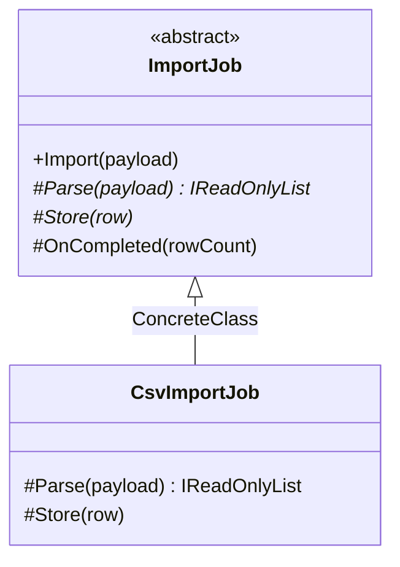

# Template Method

🌍 🇬🇧 English (this file) · 🇫🇷 [Français](TemplateMethod-fr.md)

## Intent

Template Method is a behavioural pattern that defines the skeleton of an algorithm in an operation,
deferring some steps to subclasses so they can redefine them without changing the algorithm's structure.

## Problem

Every import does the same three things: parse the payload, store each row, report what happened. What
changes between a CSV import and an XML one is how a payload becomes rows, not the shape of the job.

Written per format, the shape is copied per format, and the day the sequence gains a step — a validation,
a transaction, a progress report — it has to be added everywhere it was copied, correctly, in the same
place.

## Solution

The pattern writes the sequence once, in a method that calls operations it does not implement.

The base class holds the order and the invariants; subclasses supply the steps. The sequence cannot be
got wrong by a subclass because a subclass never writes it — it fills in blanks. The book calls this the
Hollywood principle: don't call us, we'll call you.

## Structure



One hierarchy, unlike most behavioural patterns. Template Method varies behaviour by inheritance, which
is what makes it the cheapest of them and the least flexible.

## The roles

| Role | Annotation | Applies to | What it carries |
|---|---|---|---|
| AbstractClass | `[TemplateMethod.AbstractClass]` | class | Defines the skeleton of the algorithm, and declares the steps subclasses must supply. |
| ConcreteClass | `[TemplateMethod.ConcreteClass]` | class | Supplies the steps the algorithm defers to subclasses. |
| TemplateMethod | `[TemplateMethod.TemplateMethod]` | method | The operation that holds the skeleton of the algorithm, and calls the deferred steps. |
| PrimitiveOperation | `[TemplateMethod.PrimitiveOperation]` | method | A step the algorithm defers, and which subclasses must supply. |
| HookOperation | `[TemplateMethod.HookOperation]` | method | A step the algorithm defers, and which subclasses may override, but need not. |

Three of the five roles are methods, and the distinction between the last two is the pattern's most
useful and least observed detail.

## The example

From [`TemplateMethodUsage.cs`](../../../../DesignPatternCatalog.Usage/GangOfFour/TemplateMethodUsage.cs).

```csharp
[TemplateMethod.AbstractClass]
public abstract class ImportJob {

    [TemplateMethod.TemplateMethod]
    public void Import(string payload) {
        IReadOnlyList<string> rows = Parse(payload);
        foreach (string row in rows) { Store(row); }
        OnCompleted(rows.Count);
    }
```

`Import` is `public` and **not** `virtual`. That is the pattern: the sequence is offered to callers and
withheld from subclasses, so no subclass can quietly reorder it or skip a step.

```csharp
    [TemplateMethod.PrimitiveOperation]
    protected abstract IReadOnlyList<string> Parse(string payload);

    [TemplateMethod.PrimitiveOperation]
    protected abstract void Store(string row);
```

The primitives are `abstract`: a subclass has no choice, and the compiler says so.

```csharp
    [TemplateMethod.HookOperation]
    protected virtual void OnCompleted(int rowCount) { }

}
```

The hook is `virtual` with an empty body: a subclass may take the opportunity and most will not. The two
annotations differ where the two keywords differ, and a reader who knows one knows the other.

```csharp
[TemplateMethod.ConcreteClass(AbstractClass = typeof(ImportJob))]
public sealed class CsvImportJob : ImportJob {

    protected override IReadOnlyList<string> Parse(string payload) => payload.Split('\n');

    protected override void Store(string row) { }

}
```

A whole import in two overrides. It declines the hook, which is what a hook is for.

## Applicability

**Use Template Method to implement the invariant parts of an algorithm once**, leaving the varying
behaviour to subclasses.

**Use Template Method to factor and localise the common behaviour among subclasses**, so that the
duplication moves into a base class — the book presents this as a use of the pattern found by
refactoring rather than by design.

**Use Template Method to control the points at which subclasses may extend**, by calling hook operations
at specific places and only there.

## When not to use it

**Do not use Template Method where the variation should be chosen at run time.** Inheritance fixes the
steps when the object is constructed; `Strategy` chooses them afterwards and allows one object to change
behaviour without changing type.

**Do not use Template Method where the steps must be combined.** A subclass gets one set of steps, so two
independent variations — the format and the destination — produce a class per pairing, which is the
explosion `Bridge` exists to prevent.

**Do not let the template method be overridable.** A `virtual` template method invites a subclass to
replace the sequence, and the invariants the base class was written to protect stop being invariants.

**Do not multiply the hooks.** Every hook is a promise about when it is called, so a base class with many
of them has published its internal order as an interface, and reordering the algorithm becomes a
breaking change.

**Do not use Template Method where subclasses need the base class's data.** Steps that require access to
protected fields couple the subclass to the base's representation, and the composition-based patterns
avoid that by passing what a step needs as arguments.

## Advantages

* The algorithm exists once, so it cannot drift between variants.
* The extension points are explicit and finite: a reader knows exactly what a subclass may change.
* Adding a variant is supplying two methods, with the compiler naming the ones that are required.

## Drawbacks

* Inheritance, with everything it implies: one base class per hierarchy, behaviour fixed at
  construction, and a subclass coupled to a base it did not write.
* The base class's call order becomes an implicit contract that subclasses depend on.
* Debugging a template method means reading two classes at once, since the sequence and the steps are
  never in the same file.

## Relations with other patterns

**`FactoryMethod`** is very often called from a template method: the special case where the deferred step
is the creation of an object.

**`Strategy`** achieves the same variation by composition rather than inheritance, and lets it change at
run time. The trade is one object against one subclass.

**`HookOperation`** distinguishes this pattern from ordinary inheritance: an overridable method is not a
hook unless the algorithm calls it at a point the base class chose.

## Source

*Design Patterns: Elements of Reusable Object-Oriented Software*, Gamma, Helm, Johnson & Vlissides,
Addison-Wesley, 1994 — the behavioural patterns chapter.

* [Index entry](../../../generated/catalog-index.md#templatemethod-gang-of-four)
* [Generated attribute](../../../../DesignPatternCatalog.GangOfFour/TemplateMethod.cs)
* [Sample](../../../../DesignPatternCatalog.Usage/GangOfFour/TemplateMethodUsage.cs)
