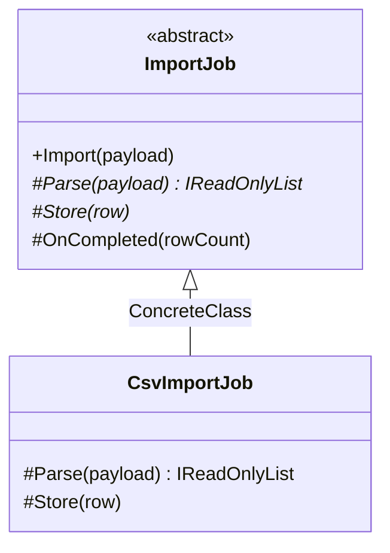

# Template Method

🌍 🇫🇷 Français (ce fichier) · 🇬🇧 [English](TemplateMethod-en.md)

## Intention

Template Method est un patron comportemental qui définit le squelette d'un algorithme dans une opération,
en déléguant certaines étapes aux sous-classes afin qu'elles puissent les redéfinir sans changer la
structure de l'algorithme.

## Problème

Tout import fait les trois mêmes choses : analyser la charge utile, stocker chaque ligne, rendre compte.
Ce qui change entre un import CSV et un import XML, c'est la façon dont une charge utile devient des
lignes, non la forme du travail.

Écrite par format, la forme est recopiée par format, et le jour où la séquence gagne une étape — une
validation, une transaction, un compte rendu de progression — il faut l'ajouter partout où elle a été
recopiée, correctement, au même endroit.

## Solution

Le patron écrit la séquence une fois, dans une méthode qui appelle des opérations qu'elle n'implémente
pas.

La classe de base porte l'ordre et les invariants ; les sous-classes fournissent les étapes. La séquence
ne peut pas être faussée par une sous-classe, puisqu'une sous-classe ne l'écrit jamais : elle remplit des
blancs. Le livre appelle cela le principe d'Hollywood : ne nous appelez pas, nous vous appellerons.

## Structure



Une seule hiérarchie, à la différence de la plupart des patrons comportementaux. Template Method fait
varier le comportement par héritage, ce qui en fait le moins coûteux d'entre eux et le moins souple.

## Les rôles

| Rôle | Annotation | S'applique à | Ce qu'il porte |
|---|---|---|---|
| AbstractClass | `[TemplateMethod.AbstractClass]` | classe | Définit le squelette de l'algorithme, et déclare les étapes que les sous-classes doivent fournir. |
| ConcreteClass | `[TemplateMethod.ConcreteClass]` | classe | Fournit les étapes que l'algorithme délègue aux sous-classes. |
| TemplateMethod | `[TemplateMethod.TemplateMethod]` | méthode | L'opération qui porte le squelette de l'algorithme, et appelle les étapes déléguées. |
| PrimitiveOperation | `[TemplateMethod.PrimitiveOperation]` | méthode | Une étape que l'algorithme délègue, et que les sous-classes doivent fournir. |
| HookOperation | `[TemplateMethod.HookOperation]` | méthode | Une étape que l'algorithme délègue, et que les sous-classes peuvent redéfinir sans y être tenues. |

Trois des cinq rôles sont des méthodes, et la distinction entre les deux derniers est le détail le plus
utile et le moins observé du patron.

## L'exemple

Extrait de [`TemplateMethodUsage.cs`](../../../../DesignPatternCatalog.Usage/GangOfFour/TemplateMethodUsage.cs).

```csharp
[TemplateMethod.AbstractClass]
public abstract class ImportJob {

    [TemplateMethod.TemplateMethod]
    public void Import(string payload) {
        IReadOnlyList<string> rows = Parse(payload);
        foreach (string row in rows) { Store(row); }
        OnCompleted(rows.Count);
    }
```

`Import` est `public` et **n'est pas** `virtual`. C'est le patron : la séquence est offerte aux appelants
et refusée aux sous-classes, de sorte qu'aucune ne puisse discrètement la réordonner ou sauter une étape.

```csharp
    [TemplateMethod.PrimitiveOperation]
    protected abstract IReadOnlyList<string> Parse(string payload);

    [TemplateMethod.PrimitiveOperation]
    protected abstract void Store(string row);
```

Les primitives sont `abstract` : une sous-classe n'a pas le choix, et le compilateur le dit.

```csharp
    [TemplateMethod.HookOperation]
    protected virtual void OnCompleted(int rowCount) { }

}
```

Le crochet est `virtual` avec un corps vide : une sous-classe peut saisir l'occasion, et la plupart ne le
feront pas. Les deux annotations diffèrent là où les deux mots-clés diffèrent, et qui connaît l'un connaît
l'autre.

```csharp
[TemplateMethod.ConcreteClass(AbstractClass = typeof(ImportJob))]
public sealed class CsvImportJob : ImportJob {

    protected override IReadOnlyList<string> Parse(string payload) => payload.Split('\n');

    protected override void Store(string row) { }

}
```

Un import entier en deux redéfinitions. Il décline le crochet, ce à quoi sert un crochet.

## Possibilités d'application

**Utilisez Template Method pour implémenter une fois les parties invariantes d'un algorithme**, en
laissant aux sous-classes le comportement qui varie.

**Utilisez Template Method pour factoriser et localiser le comportement commun à des sous-classes**, la
duplication remontant dans une classe de base — le livre présente cet usage comme trouvé par
refactorisation plutôt que par conception.

**Utilisez Template Method pour maîtriser les points d'extension des sous-classes**, en appelant des
opérations crochets à des endroits précis et seulement là.

## Quand ne pas l'utiliser

**N'utilisez pas Template Method là où la variation doit être choisie à l'exécution.** L'héritage fixe les
étapes à la construction de l'objet ; `Strategy` les choisit ensuite et permet à un objet de changer de
comportement sans changer de type.

**N'utilisez pas Template Method là où les étapes doivent se combiner.** Une sous-classe obtient un jeu
d'étapes : deux variations indépendantes — le format et la destination — produisent une classe par paire,
ce qui est l'explosion que `Bridge` existe pour empêcher.

**Ne rendez pas la méthode gabarit redéfinissable.** Une méthode gabarit `virtual` invite une sous-classe à
remplacer la séquence, et les invariants que la classe de base protégeait cessent d'en être.

**Ne multipliez pas les crochets.** Chaque crochet est une promesse sur le moment où il est appelé : une
classe de base qui en compte beaucoup a publié son ordre interne comme une interface, et réordonner
l'algorithme devient un changement cassant.

**N'utilisez pas Template Method là où les sous-classes ont besoin des données de la classe de base.** Des
étapes qui exigent l'accès à des champs protégés couplent la sous-classe à la représentation de la base,
ce que les patrons fondés sur la composition évitent en passant en argument ce dont une étape a besoin.

## Avantages

* L'algorithme existe une fois : il ne peut pas diverger entre variantes.
* Les points d'extension sont explicites et en nombre fini : un lecteur sait exactement ce qu'une
  sous-classe peut changer.
* Ajouter une variante consiste à fournir deux méthodes, le compilateur nommant celles qui sont exigées.

## Inconvénients

* L'héritage, avec tout ce qu'il implique : une seule classe de base par hiérarchie, un comportement fixé
  à la construction, une sous-classe couplée à une base qu'elle n'a pas écrite.
* L'ordre d'appel de la classe de base devient un contrat implicite dont les sous-classes dépendent.
* Déboguer une méthode gabarit oblige à lire deux classes à la fois, la séquence et les étapes n'étant
  jamais dans le même fichier.

## Liens avec les autres patrons

**`FactoryMethod`** est très souvent appelée depuis une méthode gabarit : le cas particulier où l'étape
déléguée est la création d'un objet.

**`Strategy`** obtient la même variation par composition plutôt que par héritage, et lui permet de changer
à l'exécution. L'arbitrage est un objet contre une sous-classe.

**`HookOperation`** distingue ce patron d'un héritage ordinaire : une méthode redéfinissable n'est un
crochet que si l'algorithme l'appelle à un endroit que la classe de base a choisi.

## Source

*Design Patterns: Elements of Reusable Object-Oriented Software*, Gamma, Helm, Johnson & Vlissides,
Addison-Wesley, 1994 — chapitre des patrons comportementaux.

* [Entrée d'index](../../../generated/catalog-index.md#templatemethod-gang-of-four)
* [Attribut généré](../../../../DesignPatternCatalog.GangOfFour/TemplateMethod.cs)
* [Exemple](../../../../DesignPatternCatalog.Usage/GangOfFour/TemplateMethodUsage.cs)
