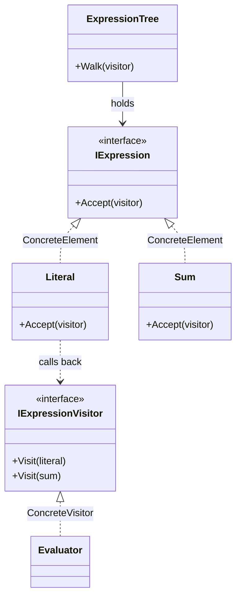

# Visitor

🌍 🇬🇧 English (this file) · 🇫🇷 [Français](Visitor-fr.md)

## Intent

Visitor is a behavioural pattern that represents an operation to be performed on the elements of an object
structure, and lets a new operation be defined without changing the classes of those elements.

## Problem

An expression tree has a handful of node types — a literal, a sum, later a product and a variable — and a
growing number of things to do with it: evaluate it, print it, simplify it, compute its depth, check its
types.

Adding each operation to every node type means reopening every node for every operation. The node classes
fill with methods that have nothing to do with being a node, and a printer's concerns end up living
inside the model.

## Solution

The pattern moves the operation out and calls it back in.

Each operation becomes one class with one method per node type. Each node keeps a single method — accept
a visitor and call the visit operation that matches its own type. That call back is what selects the
right overload, since the node knows what it is and the visitor does not.

The mechanism is *double dispatch*: the operation performed depends on both the visitor and the node, and
neither alone could choose it.

## Structure



## The roles

| Role | Annotation | Applies to | What it carries |
|---|---|---|---|
| Visitor | `[Visitor.Visitor]` | interface, class | Declares one visit operation per concrete element of the structure. |
| ConcreteVisitor | `[Visitor.ConcreteVisitor]` | class | Implements the visit operations: this is where the added algorithm lives. |
| Element | `[Visitor.Element]` | interface, class | Declares the entry point of the double dispatch. |
| ConcreteElement | `[Visitor.ConcreteElement]` | class, struct | Dispatches to the visit operation that corresponds to its own type. |
| ObjectStructure | `[Visitor.ObjectStructure]` | class | Holds the elements, and offers a way to walk them. |
| VisitMethod | `[Visitor.VisitMethod]` | method | The operation applied to one given concrete element. |
| AcceptMethod | `[Visitor.AcceptMethod]` | method | The entry point of the double dispatch: it calls back the matching visit operation. |

Seven roles, the most of any pattern in this catalogue.

## The example

From [`VisitorUsage.cs`](../../../../DesignPatternCatalog.Usage/GangOfFour/VisitorUsage.cs).

```csharp
[Visitor.Visitor]
public interface IExpressionVisitor {

    [Visitor.VisitMethod(ConcreteElement = typeof(Literal))]
    void Visit(Literal literal);

    [Visitor.VisitMethod(ConcreteElement = typeof(Sum))]
    void Visit(Sum sum);

}
```

One overload per node type, and each annotation names the element it serves. This interface is the
pattern's cost written down: every node type in the structure appears here, and adding one adds a member
that every visitor must then implement.

```csharp
[Visitor.Element]
public interface IExpression {

    [Visitor.AcceptMethod]
    void Accept(IExpressionVisitor visitor);

}

[Visitor.ConcreteElement(Element = typeof(IExpression))]
public sealed record Literal(decimal Value) : IExpression {
    public void Accept(IExpressionVisitor visitor) => visitor.Visit(this);
}
```

`visitor.Visit(this)` is the whole of double dispatch. Inside `Literal`, `this` is statically a `Literal`,
so the compiler picks the right overload — a choice that could not be made from the visitor's side, where
the value is only an `IExpression`.

```csharp
[Visitor.ObjectStructure(Element = typeof(IExpression))]
public sealed class ExpressionTree {

    public ExpressionTree(IExpression root) { Root = root; }

    public IExpression Root { get; }

    public void Walk(IExpressionVisitor visitor) => Root.Accept(visitor);

}
```

The object structure offers the traversal, so callers do not each write their own.

```csharp
[Visitor.ConcreteVisitor(Visitor = typeof(IExpressionVisitor))]
public sealed class Evaluator : IExpressionVisitor {

    private decimal _result;

    public decimal Result => _result;

    public void Visit(Literal literal) => _result = literal.Value;

    public void Visit(Sum sum) {
        sum.Left.Accept(this);
        decimal left = _result;
        sum.Right.Accept(this);
        _result += left;
    }

}
```

One operation, in one file, over the whole tree — which is what the pattern was for.

The evaluator accumulates into a field because the visit operations return nothing, and that field is why
the class is not reusable across two traversals without being reset. Carrying a result in mutable state is
the standard consequence of a `void` visit signature, and the reason a visitor is usually a short-lived
object created for one walk.

## Applicability

**Use Visitor when an object structure contains many classes of objects with differing interfaces**, and
operations are needed that depend on their concrete classes.

**Use Visitor when many distinct and unrelated operations are performed on the objects**, and polluting
their classes with all of them is not wanted.

**Use Visitor when the classes defining the structure rarely change, but new operations are often added**
— and the book is explicit that changing the structure's classes often is what makes the pattern
inappropriate.

## When not to use it

**Do not use Visitor where new element types are expected.** This is the book's own stated drawback and
it is severe: every new node type adds a member to the visitor interface and breaks every visitor already
written. The pattern trades ease of adding operations for difficulty in adding elements, and that trade
has to be the right way round.

**Do not use Visitor where the elements must stay encapsulated.** A visitor works on state the element has
to expose, so the pattern pushes elements towards public members they would not otherwise need. The book
names the tension directly.

**Do not use Visitor where the language does the dispatch.** Pattern matching over a closed hierarchy —
`expression switch { Literal l => …, Sum s => … }` — expresses one operation over several node types in
one method, with the compiler warning on unhandled cases. A `sealed` hierarchy plus a switch is often the
better shape in modern C#, and Visitor earns its seven roles where several operations must share a
traversal or the hierarchy is not sealed.

**Do not use Visitor for one operation.** Seven roles and an interface per element type is a large
apparatus for a single walk.

## Advantages

* Adding an operation is adding one class, with no change to the structure.
* Related behaviour is gathered in one visitor instead of being spread over every element type.
* A visitor accumulates state across a traversal, which a set of methods on the elements could not do
  without passing it explicitly.

## Drawbacks

* Adding a concrete element breaks every visitor: the interface grows, and each implementation must
  answer.
* Encapsulation weakens, since elements must expose enough for visitors to work.
* The double dispatch is indirect to read: the operation performed is decided in a file other than the
  one being read.

## Relations with other patterns

**`Composite`** is very often the structure a visitor walks, and the two are presented together in the
book.

**`Interpreter`** can define its interpretation as a visitor over the syntax tree rather than as a method
on each node.

**`Iterator`** is an alternative for the traversal itself: a visitor can be driven by an iterator instead
of by an object structure's own walk.

## Source

*Design Patterns: Elements of Reusable Object-Oriented Software*, Gamma, Helm, Johnson & Vlissides,
Addison-Wesley, 1994 — the behavioural patterns chapter.

* [Index entry](../../../generated/catalog-index.md#visitor-gang-of-four)
* [Generated attribute](../../../../DesignPatternCatalog.GangOfFour/Visitor.cs)
* [Sample](../../../../DesignPatternCatalog.Usage/GangOfFour/VisitorUsage.cs)
