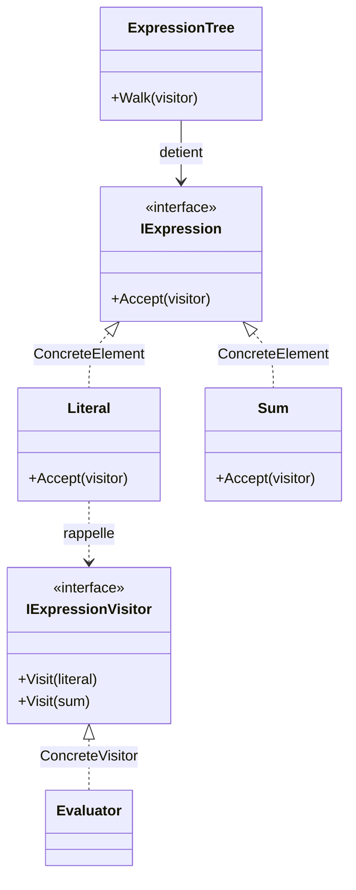

# Visitor

🌍 🇫🇷 Français (ce fichier) · 🇬🇧 [English](Visitor-en.md)

## Intention

Visitor est un patron comportemental qui représente une opération à effectuer sur les éléments d'une
structure d'objets, et permet de définir une nouvelle opération sans changer les classes de ces éléments.

## Problème

Un arbre d'expressions compte quelques types de nœuds — un littéral, une somme, plus tard un produit et
une variable — et un nombre croissant de choses à en faire : l'évaluer, l'imprimer, le simplifier,
calculer sa profondeur, en vérifier les types.

Ajouter chaque opération à chaque type de nœud oblige à rouvrir chaque nœud pour chaque opération. Les
classes de nœuds se remplissent de méthodes qui n'ont rien à voir avec le fait d'être un nœud, et les
préoccupations d'un afficheur finissent par vivre dans le modèle.

## Solution

Le patron sort l'opération et la fait rappeler.

Chaque opération devient une classe munie d'une méthode par type de nœud. Chaque nœud conserve une seule
méthode : accepter un visiteur et appeler l'opération de visite qui correspond à son propre type. Ce
rappel est ce qui sélectionne la bonne surcharge, puisque le nœud sait ce qu'il est et le visiteur non.

Le mécanisme est la *double répartition* : l'opération effectuée dépend à la fois du visiteur et du nœud,
et aucun des deux seul ne pourrait la choisir.

## Structure



## Les rôles

| Rôle | Annotation | S'applique à | Ce qu'il porte |
|---|---|---|---|
| Visitor | `[Visitor.Visitor]` | interface, classe | Déclare une opération de visite par élément concret de la structure. |
| ConcreteVisitor | `[Visitor.ConcreteVisitor]` | classe | Implémente les opérations de visite : c'est là que vit l'algorithme ajouté. |
| Element | `[Visitor.Element]` | interface, classe | Déclare le point d'entrée de la double répartition. |
| ConcreteElement | `[Visitor.ConcreteElement]` | classe, struct | Répartit vers l'opération de visite correspondant à son propre type. |
| ObjectStructure | `[Visitor.ObjectStructure]` | classe | Détient les éléments, et offre un moyen de les parcourir. |
| VisitMethod | `[Visitor.VisitMethod]` | méthode | L'opération appliquée à un élément concret donné. |
| AcceptMethod | `[Visitor.AcceptMethod]` | méthode | Le point d'entrée de la double répartition : il rappelle l'opération de visite correspondante. |

Sept rôles, le plus grand nombre de tous les patrons de ce catalogue.

## L'exemple

Extrait de [`VisitorUsage.cs`](../../../../DesignPatternCatalog.Usage/GangOfFour/VisitorUsage.cs).

```csharp
[Visitor.Visitor]
public interface IExpressionVisitor {

    [Visitor.VisitMethod(ConcreteElement = typeof(Literal))]
    void Visit(Literal literal);

    [Visitor.VisitMethod(ConcreteElement = typeof(Sum))]
    void Visit(Sum sum);

}
```

Une surcharge par type de nœud, chaque annotation nommant l'élément qu'elle sert. Cette interface est le
coût du patron mis par écrit : chaque type de nœud de la structure y figure, et en ajouter un ajoute un
membre que tous les visiteurs devront ensuite implémenter.

```csharp
[Visitor.Element]
public interface IExpression {

    [Visitor.AcceptMethod]
    void Accept(IExpressionVisitor visitor);

}

[Visitor.ConcreteElement(Element = typeof(IExpression))]
public sealed record Literal(decimal Value) : IExpression {
    public void Accept(IExpressionVisitor visitor) => visitor.Visit(this);
}
```

`visitor.Visit(this)` est toute la double répartition. À l'intérieur de `Literal`, `this` est
statiquement un `Literal` : le compilateur choisit donc la bonne surcharge — un choix impossible depuis le
côté du visiteur, où la valeur n'est qu'un `IExpression`.

```csharp
[Visitor.ObjectStructure(Element = typeof(IExpression))]
public sealed class ExpressionTree {

    public ExpressionTree(IExpression root) { Root = root; }

    public IExpression Root { get; }

    public void Walk(IExpressionVisitor visitor) => Root.Accept(visitor);

}
```

La structure d'objets offre le parcours, pour que les appelants n'en écrivent pas chacun un.

```csharp
[Visitor.ConcreteVisitor(Visitor = typeof(IExpressionVisitor))]
public sealed class Evaluator : IExpressionVisitor {

    private decimal _result;

    public decimal Result => _result;

    public void Visit(Literal literal) => _result = literal.Value;

    public void Visit(Sum sum) {
        sum.Left.Accept(this);
        decimal left = _result;
        sum.Right.Accept(this);
        _result += left;
    }

}
```

Une opération, dans un fichier, sur tout l'arbre — ce à quoi le patron servait.

L'évaluateur accumule dans un champ parce que les opérations de visite ne rendent rien, et ce champ est la
raison pour laquelle la classe n'est pas réutilisable sur deux parcours sans être réinitialisée. Porter un
résultat dans un état mutable est la conséquence habituelle d'une signature de visite en `void`, et la
raison pour laquelle un visiteur est d'ordinaire un objet de courte vie créé pour un seul parcours.

## Possibilités d'application

**Utilisez Visitor lorsqu'une structure d'objets contient de nombreuses classes aux interfaces
différentes**, et que des opérations dépendant de leurs classes concrètes sont nécessaires.

**Utilisez Visitor lorsque de nombreuses opérations distinctes et sans rapport s'appliquent aux objets**,
et qu'on ne veut pas polluer leurs classes avec toutes.

**Utilisez Visitor lorsque les classes définissant la structure changent rarement, mais que de nouvelles
opérations s'ajoutent souvent** — et le livre est explicite : c'est le changement fréquent des classes de
la structure qui rend le patron inapproprié.

## Quand ne pas l'utiliser

**N'utilisez pas Visitor là où de nouveaux types d'éléments sont attendus.** C'est l'inconvénient que le
livre énonce lui-même, et il est sévère : chaque nouveau type de nœud ajoute un membre à l'interface de
visiteur et casse tous les visiteurs déjà écrits. Le patron échange la facilité d'ajouter des opérations
contre la difficulté d'ajouter des éléments, et cet arbitrage doit être dans le bon sens.

**N'utilisez pas Visitor là où les éléments doivent rester encapsulés.** Un visiteur travaille sur un état
que l'élément doit exposer : le patron pousse donc les éléments vers des membres publics dont ils
n'auraient pas eu besoin. Le livre nomme cette tension directement.

**N'utilisez pas Visitor là où le langage fait la répartition.** Le filtrage par motifs sur une hiérarchie
close — `expression switch { Literal l => …, Sum s => … }` — exprime une opération sur plusieurs types de
nœuds dans une seule méthode, le compilateur signalant les cas non traités. Une hiérarchie `sealed` plus
un `switch` est souvent la meilleure forme en C# moderne, et Visitor gagne ses sept rôles là où plusieurs
opérations doivent partager un parcours ou là où la hiérarchie n'est pas close.

**N'utilisez pas Visitor pour une seule opération.** Sept rôles et une interface par type d'élément font un
grand appareillage pour un unique parcours.

## Avantages

* Ajouter une opération consiste à ajouter une classe, sans modifier la structure.
* Les comportements apparentés se rassemblent dans un visiteur au lieu de se répandre sur chaque type
  d'élément.
* Un visiteur accumule de l'état au fil d'un parcours, ce qu'un ensemble de méthodes sur les éléments ne
  pourrait faire sans le transmettre explicitement.

## Inconvénients

* Ajouter un élément concret casse tous les visiteurs : l'interface grandit, et chaque implémentation doit
  répondre.
* L'encapsulation s'affaiblit, les éléments devant exposer assez pour que les visiteurs travaillent.
* La double répartition est indirecte à lire : l'opération effectuée se décide dans un fichier autre que
  celui qu'on lit.

## Liens avec les autres patrons

**`Composite`** est très souvent la structure qu'un visiteur parcourt, et le livre présente les deux
ensemble.

**`Interpreter`** peut définir son interprétation comme un visiteur sur l'arbre syntaxique plutôt que
comme une méthode sur chaque nœud.

**`Iterator`** est une alternative pour le parcours lui-même : un visiteur peut être piloté par un
itérateur au lieu de l'être par le parcours propre d'une structure.

## Source

*Design Patterns: Elements of Reusable Object-Oriented Software*, Gamma, Helm, Johnson & Vlissides,
Addison-Wesley, 1994 — chapitre des patrons comportementaux.

* [Entrée d'index](../../../generated/catalog-index.md#visitor-gang-of-four)
* [Attribut généré](../../../../DesignPatternCatalog.GangOfFour/Visitor.cs)
* [Exemple](../../../../DesignPatternCatalog.Usage/GangOfFour/VisitorUsage.cs)
